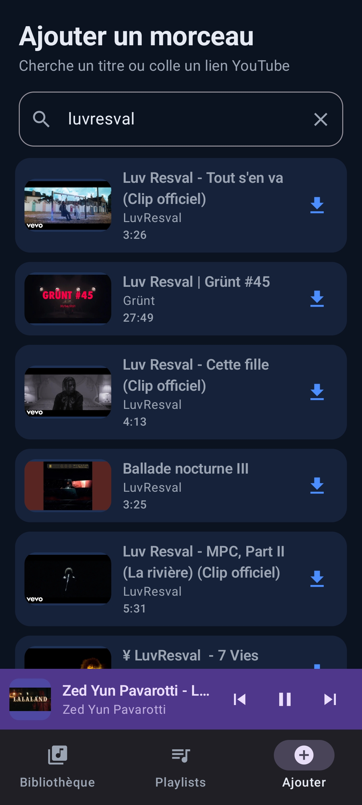

# YT Offline — version Flutter (multiplateforme)

<<<<<<< HEAD
Réécriture Flutter/Dart de l'app native, **iOS-ready** (mais l'`.ipa` se build sur macOS
uniquement — voir plus bas). L'app Kotlin d'origine reste intacte dans le reste du repo.
=======
Application Android personnelle permettant de télécharger des pistes audio
depuis YouTube pour une écoute **hors ligne**, avec un lecteur intégré (play/pause/next/previous).
>>>>>>> 61beba0b6a1a954b4c55764439824500b75a7686

## ⚠️ Partie 1 (livrée)
Fondation runnable : **base sqflite**, **extraction + recherche** (youtube_explode_dart),
**téléchargement** (audio m4a/AAC), **bibliothèque**, **lecture** (just_audio) + **mini-lecteur**.

**Partie 2 (à venir)** : playlists, lecteur plein écran (seekbar/shuffle/repeat),
lecture en arrière-plan + notification (audio_service).

## Stack
- `provider` — état / injection
- `sqflite` — base locale (pas de code-gen)
- `youtube_explode_dart` — extraction YouTube (Android **et** iOS)
- `just_audio` — lecture audio
- `cached_network_image` — miniatures

## Mise en route

1. Installe le SDK Flutter (stable) puis vérifie : `flutter doctor`.

2. Depuis ce dossier, génère les dossiers de plateforme (android/, ios/…) —
   `flutter create` **ne touche pas** aux fichiers déjà présents (`lib/`, `pubspec.yaml`) :
   ```
   flutter create . --org com.laforge --project-name yt_offline --platforms=android,ios
   ```

3. Récupère les dépendances :
   ```
   flutter pub get
   ```

4. **Permission Internet (Android)** — ajoute dans
   `android/app/src/main/AndroidManifest.xml`, juste avant `<application>` :
   ```xml
   <uses-permission android:name="android.permission.INTERNET"/>
   ```

5. Lance sur un appareil branché :
   ```
   flutter run
   ```
   ou construis l'APK :
   ```
   flutter build apk --release
   ```
   (APK dans `build/app/outputs/flutter-apk/app-release.apk`)

## iOS (.ipa) — rappel
Impossible sous Windows. Quand tu auras un Mac (Xcode) : `flutter build ipa`.
Sinon, un CI cloud (Codemagic / GitHub Actions macOS) peut le produire. Le code est déjà
cross-platform ; il faudra juste, pour l'iOS, ajouter `UIBackgroundModes: audio` dans
`ios/Runner/Info.plist` (utile surtout en partie 2 pour la lecture en fond).

<<<<<<< HEAD
## Notes
- Les fichiers audio sont dans le stockage privé de l'app (`.../music/<id>.m4a`),
  lus en interne par le lecteur (comme l'app native).
- `youtube_explode_dart`, comme toute lib d'extraction, peut casser quand YouTube change :
  faire `flutter pub upgrade youtube_explode_dart` le cas échéant.
- Je n'ai pas pu compiler ce projet de mon côté : au premier `flutter pub get`, si une
  version de dépendance coince, `flutter pub upgrade` règle en général la résolution.
- Usage strictement personnel (mêmes réserves CGU YouTube que la version native).
=======
---

## ✅ Tâches à prévoir

### Phase 1 — Setup projet
- [x] Créer le projet Android Studio (Kotlin + Compose)
- [x] Configurer Hilt
- [x] Configurer Room (entité `Track`, DAO basique)
- [x] Ajouter la lib d'extraction YouTube (NewPipeExtractor via JitPack ou Maven local)
- [x] Ajouter Media3 (`media3-exoplayer`, `media3-session`)

### Phase 2 — Extraction & téléchargement
- [x] Écran "coller un lien YouTube"
- [x] Appel à la lib d'extraction → récupérer flux audio + métadonnées (titre, durée, thumbnail)
- [x] Worker `WorkManager` pour télécharger le flux audio vers stockage interne
- [x] Sauvegarde en base Room une fois le téléchargement terminé
- [x] Gestion des erreurs (lien invalide, vidéo indisponible, pas de flux audio)

### Phase 3 — Bibliothèque
- [x] Écran liste des morceaux téléchargés (Compose `LazyColumn`)
- [x] Suppression d'un morceau (fichier + entrée DB)
- [x] Affichage taille de stockage utilisée
- [x] Recherche/tri dans la bibliothèque

### Phase 4 — Lecteur audio
- [x] `MediaSessionService` avec ExoPlayer (Media3)
- [x] Contrôles : play/pause/next/previous
- [x] Gestion de la file de lecture (queue) à partir de la bibliothèque
- [x] Notification média système (contrôles depuis l'écran verrouillé)
- [x] Mini-lecteur persistant en bas de l'écran (Compose)
- [x] Écran plein écran avec seekbar, artwork, titre/artiste

### Phase 5 — Polish
- [x] Gestion des interruptions audio (appel téléphonique, autre app média)
- [x] Mode aléatoire / répétition
- [ ] Icône et nom d'app (usage perso)
- [x] Tests manuels sur device réel

### Phase 6 (optionnelle)
- [x] Playlists locales
- [ ] Import depuis plusieurs liens à la fois
- [x] Thème sombre/clair

---

## 📦 Dépendances clés (exemple `build.gradle.kts`)

```kotlin
dependencies {
    implementation("androidx.media3:media3-exoplayer:1.4.1")
    implementation("androidx.media3:media3-session:1.4.1")
    implementation("androidx.room:room-runtime:2.6.1")
    ksp("androidx.room:room-compiler:2.6.1")
    implementation("androidx.hilt:hilt-navigation-compose:1.2.0")
    implementation("com.google.dagger:hilt-android:2.51.1")
    ksp("com.google.dagger:hilt-android-compiler:2.51.1")
    implementation("androidx.work:work-runtime-ktx:2.9.1")
    // Librairie d'extraction YouTube à ajouter séparément (JitPack)
}
```

---

## 🔒 Rappels
- App non publiée, usage strictement personnel
- Ne pas partager l'APK publiquement
- Se tenir informé des évolutions de la lib d'extraction (elle casse régulièrement suite aux changements côté YouTube)

## Preview


>>>>>>> 61beba0b6a1a954b4c55764439824500b75a7686
